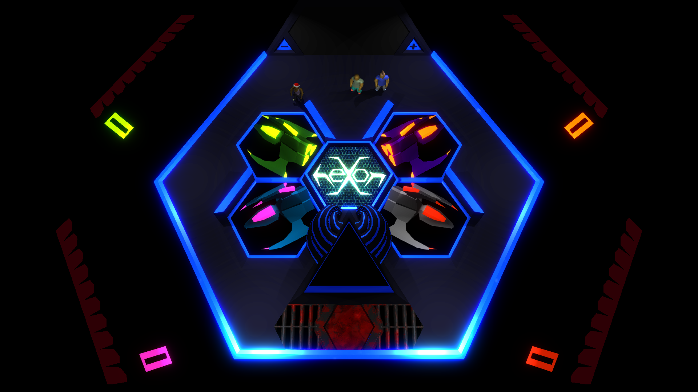

[:four_leaf_clover:](http://www.luckeyproductions.nl/) 

#### Contents

- [Summary](#summary)
- [Installation](#installation)
- [Quick guide](#quick-guide)
- [Special thanks](#special-thanks)

## Summary

heXon is a free and open source twin-stick-shooter created using the [Urho3D](http://urho3d.github.io) game engine.

To score high you must fly well, avoiding the Notyous and destroying them with your Whack-o-Slack blast battery. Your firepower can be increased by collecting five apples. Picking up five hearts in a row will charge your shield.  
All edges of the hexagonal arena are connected to its opposite like portals, making for a puzzlingly dangerous playing field that might take some experience to wrap your head around.

### Screenshots
[](Screenshots/Screenshot_Thu_Dec_22_05_25_44_2016.png)
[](Screenshots/Screenshot_Sun_Jun__5_03_02_18_2016.png)

## Installation
### Debian-based linux distros
#### Pre-built

Visit [heXon's itch.io page](http://luckeyproductions.itch.io/hexon) and hit **Download Now**. Or download heXon through the [itch app](https://itch.io/app).

<!--
#### Compiling from source

If the binary is not working you may try compiling by running this line in a terminal:

```
git clone https://github.com/LucKeyProductions/heXon; cd heXon; ./install.sh; cd ..; rm -rf heXon
```
-->

[](https://travis-ci.org/LucKeyProductions/heXon)

## Quick guide

### Pickups
* Golden apple / Provides 23 points. Collect five apples in a row to get a weapon upgrade.
* Heart / Heals half of your max life. Collect five hearts in a row to get a shield upgrade.

### Enemies
* Razors / Mostly harmless in small numbers. Don't fly into them though. 5 points on destruction.
* Spires / These sturdy towers launch player seeking foo fighters that should be evaded. 10 points when obliterated.
* Masons / The high energy wall they throw out will hit you like a gold brick in the brain. It's worth 42 points.

### Noteworthy
Explosions repel non-projectiles.
Touching the edge of the net will send most object to the opposite side.

## Controls
#### Controller
heXon is best played with a controller that has at least two analog sticks, and has been tested with PS3 controllers. These days, most controllers work out-of-the-box on Linux. Make sure it is connected before you start the game.
#### Keyboard
* Movement / WASD
* Firing / Numpad or IJKL
* Pause / P

## Special thanks

### Platforms of development
* Xubuntu GNU/Linux 64-bit
* Linux Mint 64-bit

### Tools
[Urho3D](http://urho3d.github.io), [QtCreator](http://wiki.qt.io/Category:Tools::QtCreator), [Blender](http://www.blender.org/), [Inkscape](http://inkscape.org/), [GIMP](http://gimp.org), [SuperCollider](http://supercollider.github.io/), [Audacity](http://web.audacityteam.org/)

### Soundtrack
Alien Chaos - Disorder
from [Discovering the Code](http://www.ektoplazm.com/free-music/alien-chaos-discovering-the-code)
